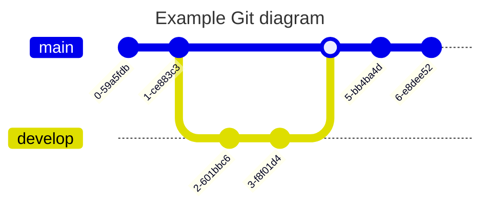

# mermaid_playground

https://github.blog/2022-02-14-include-diagrams-markdown-files-mermaid/
https://mermaid.js.org/syntax/gitgraph.html

```mermaid
---
title: Example Git diagram
---
gitGraph
   commit
   commit
   branch develop
   checkout develop
   commit
   commit
   checkout main
   merge develop
   commit
   commit
```
